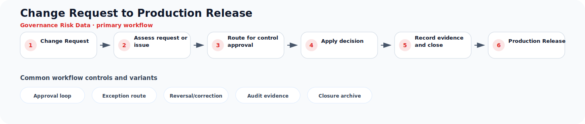

# Change Request to Production Release

**Process ID:** `BP-150`  
**Domain:** Governance Risk Data

This page describes a reusable business-process pattern that can be used by Neuro Graph when correlating custom entities, CDS models, table schemas, fields, and relationships to semantic business meaning.

## Workflow diagram



## Primary workflow

| Step | Workflow stage | Suggested RDF role |
|---:|---|---|
| 1 | Change Request | `change_request` |
| 2 | Assess request or issue | `assess_request_or_issue` |
| 3 | Route for control approval | `route_for_control_approval` |
| 4 | Apply decision | `apply_decision` |
| 5 | Record evidence and close | `record_evidence_and_close` |
| 6 | Production Release | `production_release` |

## Typical business concepts

`Policy`, `Control`, `Risk`, `Audit Finding`, `Access Request`, `Role`

## CDS or custom table signals

These signals can help an AI or rule engine correlate technical entities to this process:

- Approval workflow
- Risk or control reference
- Owner field
- Validity date
- Status history
- Audit trail

## Common variants and exception paths

- **Approval loop**: use this branch when the process requires approval loop before continuing.
- **Exception route**: use this branch when the process requires exception route before continuing.
- **Reversal/correction**: use this branch when the process requires reversal/correction before continuing.
- **Audit evidence**: use this branch when the process requires audit evidence before continuing.
- **Closure archive**: use this branch when the process requires closure archive before continuing.

## Business rules useful for RDF generation

- Governance processes require traceable approvals and ownership.
- Findings or exceptions should lead to remediation and evidence.
- Confirmed master data changes should be auditable and versioned.

## Suggested RDF mapping roles

- `change_request` → process step candidate
- `assess_request_or_issue` → process step candidate
- `route_for_control_approval` → process step candidate
- `apply_decision` → process step candidate
- `record_evidence_and_close` → process step candidate
- `production_release` → process step candidate

## Example TTL relationship pattern

```ttl
@prefix bp: <https://neuro-graph.dev/business-process/> .
@prefix ng: <https://neuro-graph.dev/ontology#> .

bp:changerequesttoproductionrelease a ng:BusinessProcessPattern ;
  ng:processId "BP-150" ;
  ng:domain "Governance Risk Data" ;
  rdfs:label "Change Request to Production Release" .
```

## Human confirmation questions

- Which custom entity acts as the initiating object for this process?
- Which entity or field represents the current status of the process?
- Which relationships represent parent-child document structure?
- Which events are approvals, exceptions, reversals, or closure events?
- Which mappings are confirmed facts and which are only candidates?
