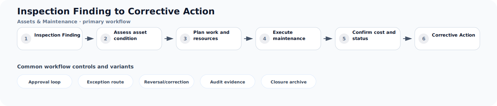

# Inspection Finding to Corrective Action

**Process ID:** `BP-100`  
**Domain:** Assets & Maintenance

This page describes a reusable business-process pattern that can be used by Neuro Graph when correlating custom entities, CDS models, table schemas, fields, and relationships to semantic business meaning.

## Workflow diagram



## Primary workflow

| Step | Workflow stage | Suggested RDF role |
|---:|---|---|
| 1 | Inspection Finding | `inspection_finding` |
| 2 | Assess asset condition | `assess_asset_condition` |
| 3 | Plan work and resources | `plan_work_and_resources` |
| 4 | Execute maintenance | `execute_maintenance` |
| 5 | Confirm cost and status | `confirm_cost_and_status` |
| 6 | Corrective Action | `corrective_action` |

## Typical business concepts

`Equipment`, `Functional Location`, `Notification`, `Work Order`, `Task`, `Spare Part`

## CDS or custom table signals

These signals can help an AI or rule engine correlate technical entities to this process:

- Equipment or asset reference
- Failure code
- Work order status
- Spare part reservation
- Labor confirmation
- Maintenance plan

## Common variants and exception paths

- **Approval loop**: use this branch when the process requires approval loop before continuing.
- **Exception route**: use this branch when the process requires exception route before continuing.
- **Reversal/correction**: use this branch when the process requires reversal/correction before continuing.
- **Audit evidence**: use this branch when the process requires audit evidence before continuing.
- **Closure archive**: use this branch when the process requires closure archive before continuing.

## Business rules useful for RDF generation

- A maintenance request usually creates a notification or work order.
- Confirmed work records labor, parts, and completion status.
- Preventive plans trigger work before failure occurs.

## Suggested RDF mapping roles

- `inspection_finding` → process step candidate
- `assess_asset_condition` → process step candidate
- `plan_work_and_resources` → process step candidate
- `execute_maintenance` → process step candidate
- `confirm_cost_and_status` → process step candidate
- `corrective_action` → process step candidate

## Example TTL relationship pattern

```ttl
@prefix bp: <https://neuro-graph.dev/business-process/> .
@prefix ng: <https://neuro-graph.dev/ontology#> .

bp:inspectionfindingtocorrectiveaction a ng:BusinessProcessPattern ;
  ng:processId "BP-100" ;
  ng:domain "Assets & Maintenance" ;
  rdfs:label "Inspection Finding to Corrective Action" .
```

## Human confirmation questions

- Which custom entity acts as the initiating object for this process?
- Which entity or field represents the current status of the process?
- Which relationships represent parent-child document structure?
- Which events are approvals, exceptions, reversals, or closure events?
- Which mappings are confirmed facts and which are only candidates?
