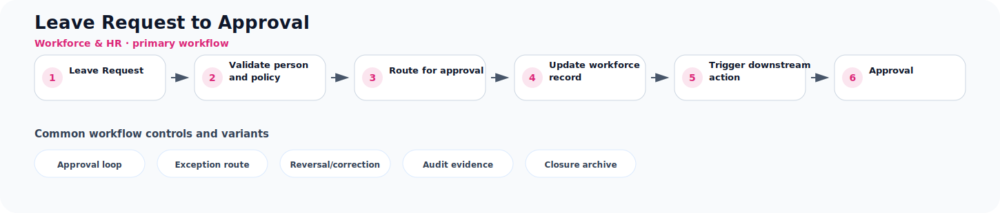

# Leave Request to Approval

**Process ID:** `BP-124`  
**Domain:** Workforce & HR

This page describes a reusable business-process pattern that can be used by Neuro Graph when correlating custom entities, CDS models, table schemas, fields, and relationships to semantic business meaning.

## Workflow diagram



## Primary workflow

| Step | Workflow stage | Suggested RDF role |
|---:|---|---|
| 1 | Leave Request | `leave_request` |
| 2 | Validate person and policy | `validate_person_and_policy` |
| 3 | Route for approval | `route_for_approval` |
| 4 | Update workforce record | `update_workforce_record` |
| 5 | Trigger downstream action | `trigger_downstream_action` |
| 6 | Approval | `approval` |

## Typical business concepts

`Employee`, `Position`, `Job Requisition`, `Candidate`, `Time Entry`, `Leave Request`

## CDS or custom table signals

These signals can help an AI or rule engine correlate technical entities to this process:

- Employee or candidate reference
- Position or job role
- Effective date
- Approval status
- Time quantity
- Payroll period

## Common variants and exception paths

- **Approval loop**: use this branch when the process requires approval loop before continuing.
- **Exception route**: use this branch when the process requires exception route before continuing.
- **Reversal/correction**: use this branch when the process requires reversal/correction before continuing.
- **Audit evidence**: use this branch when the process requires audit evidence before continuing.
- **Closure archive**: use this branch when the process requires closure archive before continuing.

## Business rules useful for RDF generation

- Workforce events are effective-dated and often approval controlled.
- Approved time and absences feed payroll or capacity planning.
- Offboarding should remove access and close employment obligations.

## Suggested RDF mapping roles

- `leave_request` → process step candidate
- `validate_person_and_policy` → process step candidate
- `route_for_approval` → process step candidate
- `update_workforce_record` → process step candidate
- `trigger_downstream_action` → process step candidate
- `approval` → process step candidate

## Example TTL relationship pattern

```ttl
@prefix bp: <https://neuro-graph.dev/business-process/> .
@prefix ng: <https://neuro-graph.dev/ontology#> .

bp:leaverequesttoapproval a ng:BusinessProcessPattern ;
  ng:processId "BP-124" ;
  ng:domain "Workforce & HR" ;
  rdfs:label "Leave Request to Approval" .
```

## Human confirmation questions

- Which custom entity acts as the initiating object for this process?
- Which entity or field represents the current status of the process?
- Which relationships represent parent-child document structure?
- Which events are approvals, exceptions, reversals, or closure events?
- Which mappings are confirmed facts and which are only candidates?
