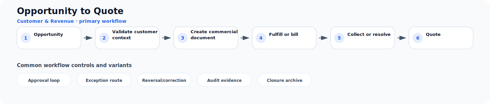

# Opportunity to Quote

**Process ID:** `BP-003`  
**Domain:** Customer & Revenue

This page describes a reusable business-process pattern that can be used by Neuro Graph when correlating custom entities, CDS models, table schemas, fields, and relationships to semantic business meaning.

## Workflow diagram



## Primary workflow

| Step | Workflow stage | Suggested RDF role |
|---:|---|---|
| 1 | Opportunity | `opportunity` |
| 2 | Validate customer context | `validate_customer_context` |
| 3 | Create commercial document | `create_commercial_document` |
| 4 | Fulfill or bill | `fulfill_or_bill` |
| 5 | Collect or resolve | `collect_or_resolve` |
| 6 | Quote | `quote` |

## Typical business concepts

`Customer`, `Lead`, `Opportunity`, `Quote`, `Order`, `Delivery`

## CDS or custom table signals

These signals can help an AI or rule engine correlate technical entities to this process:

- Customer or partner reference
- Commercial document number
- Pricing or discount fields
- Delivery or billing status
- Amount and currency
- Line item composition

## Common variants and exception paths

- **Approval loop**: use this branch when the process requires approval loop before continuing.
- **Exception route**: use this branch when the process requires exception route before continuing.
- **Reversal/correction**: use this branch when the process requires reversal/correction before continuing.
- **Audit evidence**: use this branch when the process requires audit evidence before continuing.
- **Closure archive**: use this branch when the process requires closure archive before continuing.

## Business rules useful for RDF generation

- Commercial documents usually contain one or more line items.
- A confirmed order usually precedes fulfillment or billing.
- A settlement event usually clears an open obligation.

## Suggested RDF mapping roles

- `opportunity` → process step candidate
- `validate_customer_context` → process step candidate
- `create_commercial_document` → process step candidate
- `fulfill_or_bill` → process step candidate
- `collect_or_resolve` → process step candidate
- `quote` → process step candidate

## Example TTL relationship pattern

```ttl
@prefix bp: <https://neuro-graph.dev/business-process/> .
@prefix ng: <https://neuro-graph.dev/ontology#> .

bp:opportunitytoquote a ng:BusinessProcessPattern ;
  ng:processId "BP-003" ;
  ng:domain "Customer & Revenue" ;
  rdfs:label "Opportunity to Quote" .
```

## Human confirmation questions

- Which custom entity acts as the initiating object for this process?
- Which entity or field represents the current status of the process?
- Which relationships represent parent-child document structure?
- Which events are approvals, exceptions, reversals, or closure events?
- Which mappings are confirmed facts and which are only candidates?
