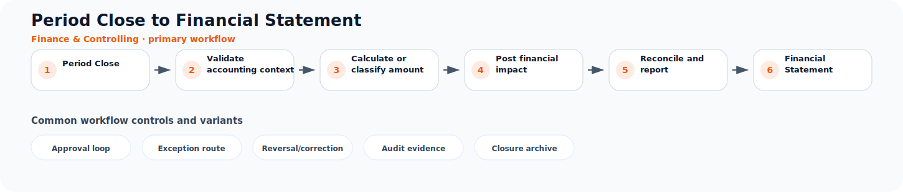

# Period Close to Financial Statement

**Process ID:** `BP-089`  
**Domain:** Finance & Controlling

This page describes a reusable business-process pattern that can be used by Neuro Graph when correlating custom entities, CDS models, table schemas, fields, and relationships to semantic business meaning.

## Workflow diagram



## Primary workflow

| Step | Workflow stage | Suggested RDF role |
|---:|---|---|
| 1 | Period Close | `period_close` |
| 2 | Validate accounting context | `validate_accounting_context` |
| 3 | Calculate or classify amount | `calculate_or_classify_amount` |
| 4 | Post financial impact | `post_financial_impact` |
| 5 | Reconcile and report | `reconcile_and_report` |
| 6 | Financial Statement | `financial_statement` |

## Typical business concepts

`Journal Entry`, `Ledger`, `Account`, `Cost Center`, `Profit Center`, `Asset`

## CDS or custom table signals

These signals can help an AI or rule engine correlate technical entities to this process:

- General ledger account
- Debit and credit amounts
- Fiscal period
- Company or ledger
- Cost object
- Clearing status

## Common variants and exception paths

- **Approval loop**: use this branch when the process requires approval loop before continuing.
- **Exception route**: use this branch when the process requires exception route before continuing.
- **Reversal/correction**: use this branch when the process requires reversal/correction before continuing.
- **Audit evidence**: use this branch when the process requires audit evidence before continuing.
- **Closure archive**: use this branch when the process requires closure archive before continuing.

## Business rules useful for RDF generation

- Financial postings must balance debit and credit amounts.
- Payments usually clear open receivables or payables.
- Period close consolidates validated postings into reports.

## Suggested RDF mapping roles

- `period_close` → process step candidate
- `validate_accounting_context` → process step candidate
- `calculate_or_classify_amount` → process step candidate
- `post_financial_impact` → process step candidate
- `reconcile_and_report` → process step candidate
- `financial_statement` → process step candidate

## Example TTL relationship pattern

```ttl
@prefix bp: <https://neuro-graph.dev/business-process/> .
@prefix ng: <https://neuro-graph.dev/ontology#> .

bp:periodclosetofinancialstatement a ng:BusinessProcessPattern ;
  ng:processId "BP-089" ;
  ng:domain "Finance & Controlling" ;
  rdfs:label "Period Close to Financial Statement" .
```

## Human confirmation questions

- Which custom entity acts as the initiating object for this process?
- Which entity or field represents the current status of the process?
- Which relationships represent parent-child document structure?
- Which events are approvals, exceptions, reversals, or closure events?
- Which mappings are confirmed facts and which are only candidates?
