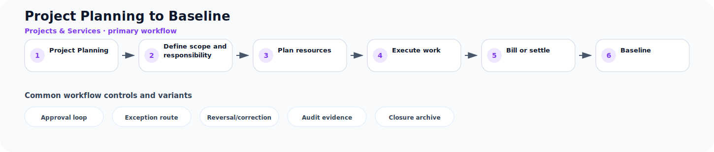

# Project Planning to Baseline

**Process ID:** `BP-106`  
**Domain:** Projects & Services

This page describes a reusable business-process pattern that can be used by Neuro Graph when correlating custom entities, CDS models, table schemas, fields, and relationships to semantic business meaning.

## Workflow diagram



## Primary workflow

| Step | Workflow stage | Suggested RDF role |
|---:|---|---|
| 1 | Project Planning | `project_planning` |
| 2 | Define scope and responsibility | `define_scope_and_responsibility` |
| 3 | Plan resources | `plan_resources` |
| 4 | Execute work | `execute_work` |
| 5 | Bill or settle | `bill_or_settle` |
| 6 | Baseline | `baseline` |

## Typical business concepts

`Project`, `Work Package`, `Milestone`, `Resource`, `Timesheet`, `Service Order`

## CDS or custom table signals

These signals can help an AI or rule engine correlate technical entities to this process:

- Project or work package reference
- Milestone status
- Time or effort fields
- Service confirmation
- Billing relevance
- Cost and revenue fields

## Common variants and exception paths

- **Approval loop**: use this branch when the process requires approval loop before continuing.
- **Exception route**: use this branch when the process requires exception route before continuing.
- **Reversal/correction**: use this branch when the process requires reversal/correction before continuing.
- **Audit evidence**: use this branch when the process requires audit evidence before continuing.
- **Closure archive**: use this branch when the process requires closure archive before continuing.

## Business rules useful for RDF generation

- Approved work packages authorize execution and cost capture.
- Service confirmation usually precedes billing.
- Project settlement allocates cost and revenue to target objects.

## Suggested RDF mapping roles

- `project_planning` → process step candidate
- `define_scope_and_responsibility` → process step candidate
- `plan_resources` → process step candidate
- `execute_work` → process step candidate
- `bill_or_settle` → process step candidate
- `baseline` → process step candidate

## Example TTL relationship pattern

```ttl
@prefix bp: <https://neuro-graph.dev/business-process/> .
@prefix ng: <https://neuro-graph.dev/ontology#> .

bp:projectplanningtobaseline a ng:BusinessProcessPattern ;
  ng:processId "BP-106" ;
  ng:domain "Projects & Services" ;
  rdfs:label "Project Planning to Baseline" .
```

## Human confirmation questions

- Which custom entity acts as the initiating object for this process?
- Which entity or field represents the current status of the process?
- Which relationships represent parent-child document structure?
- Which events are approvals, exceptions, reversals, or closure events?
- Which mappings are confirmed facts and which are only candidates?
