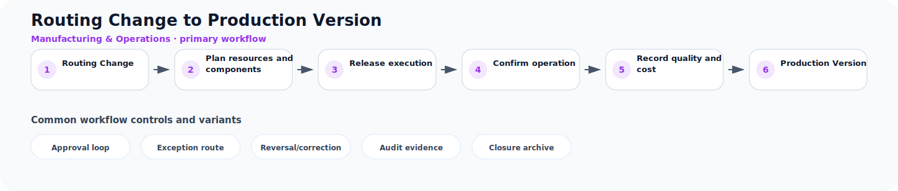

# Routing Change to Production Version

**Process ID:** `BP-066`  
**Domain:** Manufacturing & Operations

This page describes a reusable business-process pattern that can be used by Neuro Graph when correlating custom entities, CDS models, table schemas, fields, and relationships to semantic business meaning.

## Workflow diagram



## Primary workflow

| Step | Workflow stage | Suggested RDF role |
|---:|---|---|
| 1 | Routing Change | `routing_change` |
| 2 | Plan resources and components | `plan_resources_and_components` |
| 3 | Release execution | `release_execution` |
| 4 | Confirm operation | `confirm_operation` |
| 5 | Record quality and cost | `record_quality_and_cost` |
| 6 | Production Version | `production_version` |

## Typical business concepts

`Production Order`, `Operation`, `Bill of Material`, `Routing`, `Work Center`, `Consumption`

## CDS or custom table signals

These signals can help an AI or rule engine correlate technical entities to this process:

- Production order reference
- Operation or routing step
- Component consumption
- Yield or scrap quantity
- Work center
- Confirmation status

## Common variants and exception paths

- **Approval loop**: use this branch when the process requires approval loop before continuing.
- **Exception route**: use this branch when the process requires exception route before continuing.
- **Reversal/correction**: use this branch when the process requires reversal/correction before continuing.
- **Audit evidence**: use this branch when the process requires audit evidence before continuing.
- **Closure archive**: use this branch when the process requires closure archive before continuing.

## Business rules useful for RDF generation

- Released production orders usually consume components and confirm operations.
- Quality decisions may allow, block, or rework produced quantity.
- Production settlement records variance and cost impact.

## Suggested RDF mapping roles

- `routing_change` → process step candidate
- `plan_resources_and_components` → process step candidate
- `release_execution` → process step candidate
- `confirm_operation` → process step candidate
- `record_quality_and_cost` → process step candidate
- `production_version` → process step candidate

## Example TTL relationship pattern

```ttl
@prefix bp: <https://neuro-graph.dev/business-process/> .
@prefix ng: <https://neuro-graph.dev/ontology#> .

bp:routingchangetoproductionversion a ng:BusinessProcessPattern ;
  ng:processId "BP-066" ;
  ng:domain "Manufacturing & Operations" ;
  rdfs:label "Routing Change to Production Version" .
```

## Human confirmation questions

- Which custom entity acts as the initiating object for this process?
- Which entity or field represents the current status of the process?
- Which relationships represent parent-child document structure?
- Which events are approvals, exceptions, reversals, or closure events?
- Which mappings are confirmed facts and which are only candidates?
