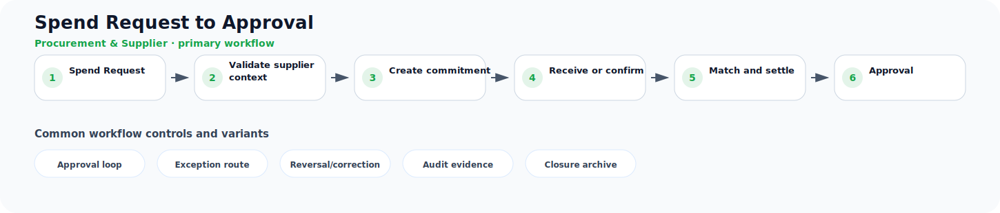

# Spend Request to Approval

**Process ID:** `BP-030`  
**Domain:** Procurement & Supplier

This page describes a reusable business-process pattern that can be used by Neuro Graph when correlating custom entities, CDS models, table schemas, fields, and relationships to semantic business meaning.

## Workflow diagram



## Primary workflow

| Step | Workflow stage | Suggested RDF role |
|---:|---|---|
| 1 | Spend Request | `spend_request` |
| 2 | Validate supplier context | `validate_supplier_context` |
| 3 | Create commitment | `create_commitment` |
| 4 | Receive or confirm | `receive_or_confirm` |
| 5 | Match and settle | `match_and_settle` |
| 6 | Approval | `approval` |

## Typical business concepts

`Supplier`, `Requisition`, `Purchase Order`, `Goods Receipt`, `Supplier Invoice`, `Payment`

## CDS or custom table signals

These signals can help an AI or rule engine correlate technical entities to this process:

- Supplier or vendor reference
- Purchase document number
- Receiving or confirmation status
- Quantity and unit fields
- Net amount and currency
- Invoice matching fields

## Common variants and exception paths

- **Approval loop**: use this branch when the process requires approval loop before continuing.
- **Exception route**: use this branch when the process requires exception route before continuing.
- **Reversal/correction**: use this branch when the process requires reversal/correction before continuing.
- **Audit evidence**: use this branch when the process requires audit evidence before continuing.
- **Closure archive**: use this branch when the process requires closure archive before continuing.

## Business rules useful for RDF generation

- A purchase commitment usually precedes receipt or service confirmation.
- A supplier invoice usually references an order, receipt, or service entry.
- Payment usually settles an approved payable obligation.

## Suggested RDF mapping roles

- `spend_request` → process step candidate
- `validate_supplier_context` → process step candidate
- `create_commitment` → process step candidate
- `receive_or_confirm` → process step candidate
- `match_and_settle` → process step candidate
- `approval` → process step candidate

## Example TTL relationship pattern

```ttl
@prefix bp: <https://neuro-graph.dev/business-process/> .
@prefix ng: <https://neuro-graph.dev/ontology#> .

bp:spendrequesttoapproval a ng:BusinessProcessPattern ;
  ng:processId "BP-030" ;
  ng:domain "Procurement & Supplier" ;
  rdfs:label "Spend Request to Approval" .
```

## Human confirmation questions

- Which custom entity acts as the initiating object for this process?
- Which entity or field represents the current status of the process?
- Which relationships represent parent-child document structure?
- Which events are approvals, exceptions, reversals, or closure events?
- Which mappings are confirmed facts and which are only candidates?
