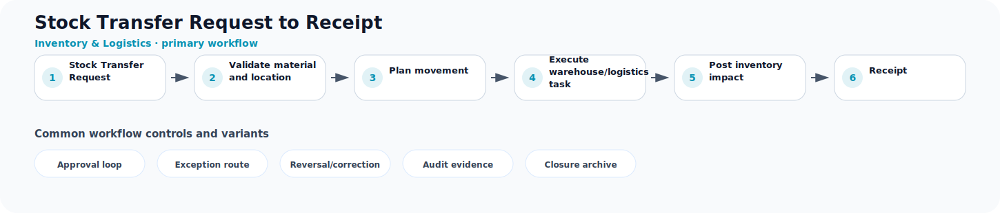

# Stock Transfer Request to Receipt

**Process ID:** `BP-040`  
**Domain:** Inventory & Logistics

This page describes a reusable business-process pattern that can be used by Neuro Graph when correlating custom entities, CDS models, table schemas, fields, and relationships to semantic business meaning.

## Workflow diagram



## Primary workflow

| Step | Workflow stage | Suggested RDF role |
|---:|---|---|
| 1 | Stock Transfer Request | `stock_transfer_request` |
| 2 | Validate material and location | `validate_material_and_location` |
| 3 | Plan movement | `plan_movement` |
| 4 | Execute warehouse/logistics task | `execute_warehouse_logistics_task` |
| 5 | Post inventory impact | `post_inventory_impact` |
| 6 | Receipt | `receipt` |

## Typical business concepts

`Material`, `Location`, `Batch`, `Stock Balance`, `Movement Event`, `Delivery`

## CDS or custom table signals

These signals can help an AI or rule engine correlate technical entities to this process:

- Material or product reference
- Plant or location field
- Batch or serial field
- Movement type
- Quantity and unit
- Stock status

## Common variants and exception paths

- **Approval loop**: use this branch when the process requires approval loop before continuing.
- **Exception route**: use this branch when the process requires exception route before continuing.
- **Reversal/correction**: use this branch when the process requires reversal/correction before continuing.
- **Audit evidence**: use this branch when the process requires audit evidence before continuing.
- **Closure archive**: use this branch when the process requires closure archive before continuing.

## Business rules useful for RDF generation

- Inventory movements change stock quantity at a location.
- Outbound fulfillment usually reduces available stock.
- Inbound receipt usually increases available stock after acceptance.

## Suggested RDF mapping roles

- `stock_transfer_request` → process step candidate
- `validate_material_and_location` → process step candidate
- `plan_movement` → process step candidate
- `execute_warehouse_logistics_task` → process step candidate
- `post_inventory_impact` → process step candidate
- `receipt` → process step candidate

## Example TTL relationship pattern

```ttl
@prefix bp: <https://neuro-graph.dev/business-process/> .
@prefix ng: <https://neuro-graph.dev/ontology#> .

bp:stocktransferrequesttoreceipt a ng:BusinessProcessPattern ;
  ng:processId "BP-040" ;
  ng:domain "Inventory & Logistics" ;
  rdfs:label "Stock Transfer Request to Receipt" .
```

## Human confirmation questions

- Which custom entity acts as the initiating object for this process?
- Which entity or field represents the current status of the process?
- Which relationships represent parent-child document structure?
- Which events are approvals, exceptions, reversals, or closure events?
- Which mappings are confirmed facts and which are only candidates?
