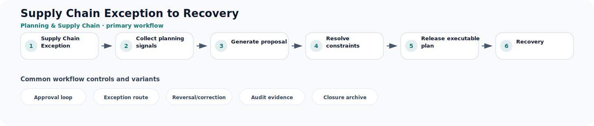

# Supply Chain Exception to Recovery

**Process ID:** `BP-140`  
**Domain:** Planning & Supply Chain

This page describes a reusable business-process pattern that can be used by Neuro Graph when correlating custom entities, CDS models, table schemas, fields, and relationships to semantic business meaning.

## Workflow diagram



## Primary workflow

| Step | Workflow stage | Suggested RDF role |
|---:|---|---|
| 1 | Supply Chain Exception | `supply_chain_exception` |
| 2 | Collect planning signals | `collect_planning_signals` |
| 3 | Generate proposal | `generate_proposal` |
| 4 | Resolve constraints | `resolve_constraints` |
| 5 | Release executable plan | `release_executable_plan` |
| 6 | Recovery | `recovery` |

## Typical business concepts

`Forecast`, `Demand Plan`, `Supply Plan`, `Capacity`, `Constraint`, `Replenishment Proposal`

## CDS or custom table signals

These signals can help an AI or rule engine correlate technical entities to this process:

- Planning period
- Forecast quantity
- Supply proposal
- Capacity bucket
- Exception code
- Version or scenario

## Common variants and exception paths

- **Approval loop**: use this branch when the process requires approval loop before continuing.
- **Exception route**: use this branch when the process requires exception route before continuing.
- **Reversal/correction**: use this branch when the process requires reversal/correction before continuing.
- **Audit evidence**: use this branch when the process requires audit evidence before continuing.
- **Closure archive**: use this branch when the process requires closure archive before continuing.

## Business rules useful for RDF generation

- Demand plans drive supply proposals across time buckets.
- Constraints require replanning, substitution, or escalation.
- Approved plans feed procurement, production, or fulfillment execution.

## Suggested RDF mapping roles

- `supply_chain_exception` → process step candidate
- `collect_planning_signals` → process step candidate
- `generate_proposal` → process step candidate
- `resolve_constraints` → process step candidate
- `release_executable_plan` → process step candidate
- `recovery` → process step candidate

## Example TTL relationship pattern

```ttl
@prefix bp: <https://neuro-graph.dev/business-process/> .
@prefix ng: <https://neuro-graph.dev/ontology#> .

bp:supplychainexceptiontorecovery a ng:BusinessProcessPattern ;
  ng:processId "BP-140" ;
  ng:domain "Planning & Supply Chain" ;
  rdfs:label "Supply Chain Exception to Recovery" .
```

## Human confirmation questions

- Which custom entity acts as the initiating object for this process?
- Which entity or field represents the current status of the process?
- Which relationships represent parent-child document structure?
- Which events are approvals, exceptions, reversals, or closure events?
- Which mappings are confirmed facts and which are only candidates?
