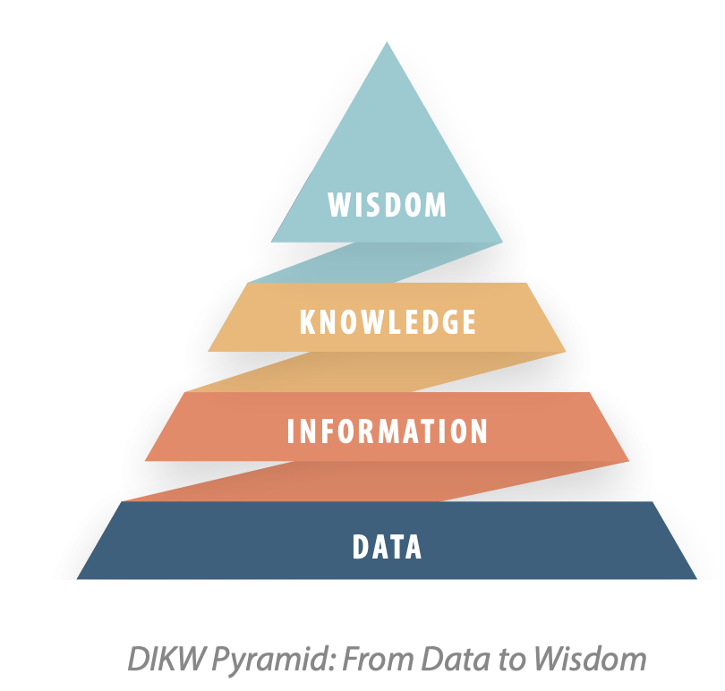

# Data, Information & Knowledge

Data is not information, and information is not yet knowledge. For decades there has
been a heated debate about the fact that a functioning knowledge management system
is not something that can be installed in an intranet like any software system, and that
knowledge cannot be stored in documents or databases. With the rise of knowledge
graphs, many knowledge management practitioners have questioned whether KGs are
just another database, or whether this is ultimately the missing link between the knowledge level and the information and data levels in the DIKW pyramid as depicted here.

